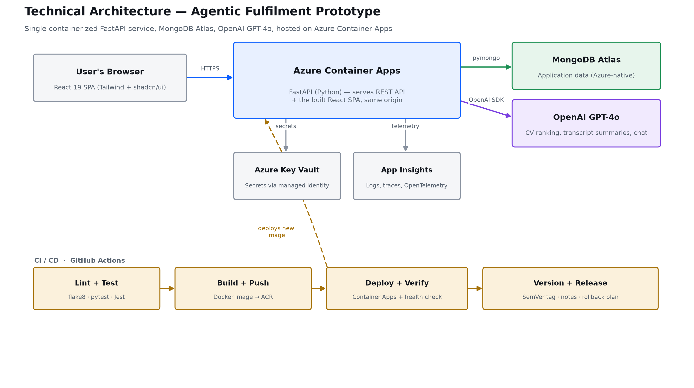
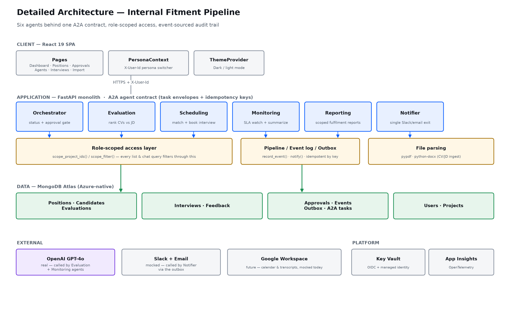

# Technical architecture — presentation content

Slide-ready content for the management deck: technical stack, proposed production path, and two architecture diagrams (PNG, ready to paste directly into a slide) with presenter notes underneath each. Grounded in the actual codebase and the live Azure resource group as of this writing — not a generic template.

---

## Slide 1 — Technical Stack & Proposed Solution

### Technical stack (current prototype)

**Frontend**
- React 19, Create React App + CRACO
- Tailwind CSS + shadcn/ui (Radix UI primitives)
- next-themes (dark/light mode), axios, sonner (toasts), lucide-react (icons)
- Jest (unit tests)

**Backend**
- FastAPI (Python 3.11) + Pydantic + Uvicorn
- PyMongo (synchronous MongoDB driver)
- OpenAI SDK — GPT-4o for CV/JD evaluation, interview transcript summaries, and chat
- pypdf + python-docx — CV/JD file parsing (PDF, DOCX)
- pytest + mongomock + flake8 — unit tests and linting

**Data**
- MongoDB Atlas — native Azure Marketplace integration (data stays inside the Azure subscription), 14 collections, no ORM — direct queries with an app-layer role-scoping filter

**Infrastructure / DevOps**
- Docker — one multi-stage image; FastAPI serves both the REST API and the built React SPA from the same origin
- Azure Container Apps (hosting) + Azure Container Registry (image registry)
- Azure Key Vault (secrets via managed identity) + Azure Application Insights (OpenTelemetry-instrumented logs/traces)
- GitHub Actions CI/CD — lint + test → build + push → deploy → health check → semantic-version tag (Conventional Commits) → auto release notes + rollback plan → GitHub Release
- OIDC federated identity — GitHub authenticates to Azure with no long-lived credentials

### Proposed solution (path to production)

- **Real authentication** — replace the persona-switcher (`X-User-Id` header) with JWT or Google SSO
- **Real Google Workspace integration** — Calendar + Meet for interview scheduling and live transcripts (currently mocked)
- **Real notifications** — Slack Bolt SDK + a transactional email provider (today: logged to an internal outbox, not actually sent)
- **Azure AI Foundry migration** — move off a direct OpenAI API key onto Azure AI Foundry / Azure OpenAI. An AI Foundry project (`proj-agentic-fulfilment-foundry`) already exists in the Azure resource group but isn't wired in yet — the natural next step for centralized model governance, quota control, and content-safety policy inside Globant's Azure tenant
- **Scale-out path, if needed** — the six agents are already decoupled behind an A2A task-envelope contract; splitting any one of them into its own service later is additive, not a rewrite
- **Full build-out via Glob.ai**, pending further approvals

---

## Slide 2 — Technical Architecture (overview)

### Presenter notes

- One container, two jobs: the same FastAPI process serves the REST API and the built React SPA — same origin, so there's no cross-origin complexity, and one artifact to build, scan, and deploy.
- MongoDB Atlas is provisioned as a native Azure Marketplace integration — it lives inside our Azure subscription, not a separate MongoDB Inc. account, so it inherits Globant's Azure billing, network, and governance boundary.
- OpenAI is called directly today via an API key held in Key Vault — that's the one piece explicitly flagged for migration on the previous slide (Azure AI Foundry already provisioned, not yet wired in).
- No secret ever sits in a config file or a GitHub secret — Key Vault plus managed identity plus OIDC federated login means the whole chain from GitHub to Azure is keyless.
- The bottom row is the CI/CD pipeline: every push to `main` is linted, tested, containerized, deployed, and health-checked — and only *then* tagged with a semantic version and released. A failing test or a failed health check stops the deploy before it reaches anyone.

---

## Slide 3 — Detailed Architecture

### Presenter notes

- Four bands, top to bottom: what the user sees, what runs the logic, where it's stored, what's outside our walls.
- The "six agents" are not six services — they're six purpose-built modules inside one FastAPI process, each with exactly one job, handing work to each other through a shared contract (an agent card, a task envelope, an idempotency key) borrowed from the emerging A2A (agent-to-agent) pattern. That's what lets us honestly call this a multi-agent system while keeping today's build simple enough to run in a single container — and any agent can be pulled out into its own service later without changing how the others call it.
- The role-scoped access layer is the single security choke point in the whole app: every list endpoint and every chat query passes through it, so a Project Manager cannot see another project's candidates by asking the chat a clever question.
- The event log and outbox are what make the audit trail and the "did we already send that" guarantee possible — every side effect (a notification, a scheduling action) is idempotent by key, so retries and duplicate clicks can't double-book an interview or double-send an email.
- Only one box in the External band is real today — OpenAI GPT-4o, for evaluation, transcript summaries, and chat. Slack, email, and Google Workspace are intentionally mocked or logged-not-sent — exactly the gap Slide 1's Proposed Solution closes.
